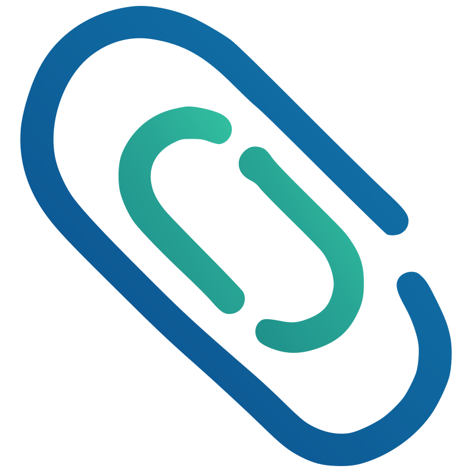

  

# ZotClip

ZotClip is a plugin for Zotero 8 and 9 that copies attachment files from the
library view or reader into the system clipboard. When the target app accepts
file pastes, attachments are pasted as files. When file-oriented clipboard
support is not available, ZotClip falls back to copying absolute attachment
paths as plain text.

## Installation

Download the latest `.xpi` from
[GitHub Releases](https://github.com/kenanking/ZotClip/releases). In Zotero,
open `Tools -> Plugins`, click the gear button, choose `Install Plugin From
File...`, and select the downloaded package. Restart Zotero if the plugin does
not appear immediately.

## System Support

| System        | Status                                   | Clipboard backend                    | What to install                                 |
| ------------- | ---------------------------------------- | ------------------------------------ | ----------------------------------------------- |
| Windows 10/11 | Supported and validated                  | Native `CF_HDROP` file copy          | Nothing extra                                   |
| Linux X11     | Supported and validated with packages    | GTK4 helper backend                  | `python3-gi` and `gir1.2-gtk-4.0`               |
| Linux Wayland | Supported and validated with packages    | `wl-copy` `text/uri-list` backend    | `wl-clipboard`                                  |
| macOS         | Implemented but not yet runtime-verified | `osascript` Finder clipboard backend | Nothing extra; `osascript` is provided by macOS |

After installation, open `Edit -> Preferences -> ZotClip` and check the
`Compatibility` section. Confirm that `Backend diagnostics` reports the
expected backend for your system and does not show a missing dependency. If the
compatibility check does not pass, install the required system package before
retesting.

The current runtime optimization pass is validated on Windows and Linux. macOS
support remains implemented in code, but it has not been manually verified yet.

## Usage

In the library view, select an attachment or a parent item and press `Ctrl+C`,
or use `Copy Attachment File(s)` from the item context menu.

In the reader, ZotClip keeps the default `Ctrl+C` behavior for text selection.
Use the reader toolbar button to copy the current attachment. If you want a
reader-specific shortcut, configure one in `Edit -> Preferences -> ZotClip`.

The settings page lets you configure:

- allowed attachment types
- multi-attachment strategy
- library shortcut
- reader shortcut
- compatibility diagnostics for the current platform

## Development

Install dependencies with `npm install`, then run `npm run start` for the local
development loop.

Before opening a PR, run:

- `npm run test:unit`
- `npm run build`
- `npm run lint:check`

Manual verification notes live in [`docs/manual-testing.md`](docs/manual-testing.md).
